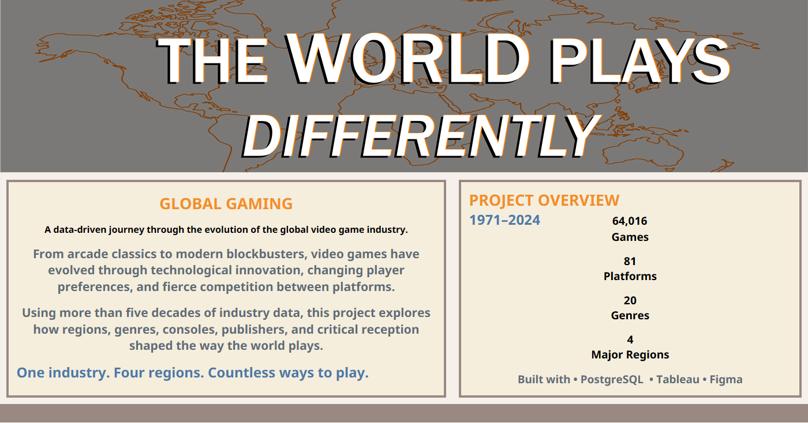

# 🎮 How the World Plays

### Exploring Four Decades of Regional Gaming Preferences (1971–2024)

<p align="center">
  
</p>

## Overview

**How the World Plays** is an editorial-style data visualization project that explores how player preferences evolved across global markets between **1971 and 2024**.

Built using **SQL, PostgreSQL, Tableau Public, and Figma**, the project transforms over **64,000 video game records** into a narrative-driven analytical experience focused on uncovering meaningful industry trends rather than presenting isolated charts.

Each chapter is designed to answer a specific analytical question, guiding readers from raw data to meaningful insights through visual storytelling.

---

## Objectives

The project was built around four main objectives:

* Explore how regional preferences shaped the global video game market.
* Identify the historical events that defined the industry's growth.
* Transform complex datasets into accessible visual narratives.
* Demonstrate an end-to-end analytics workflow from SQL to dashboard design.

---

## Dashboard Structure

The dashboard is organized into five analytical chapters, each answering a different question about the evolution of the industry.

| Chapter       | Question                                                |
| ------------- | ------------------------------------------------------- |
| **Chapter 1** | What made 2008 the greatest year in video game history? |
| **Chapter 2** | How do gaming preferences differ across global regions? |
| **Chapter 3** | How did console generations reshape player behavior?    |
| **Chapter 4** | Do all successful publishers follow the same strategy?  |
| **Chapter 5** | Do great games always become best-selling games?        |

---

## Key Insights

Throughout the analysis, several patterns emerged:

* The global video game market reached its historical sales peak in **2008**, despite **2009** releasing significantly more titles.
* Japan consistently favored **Role-Playing Games**, while Western markets showed a strong preference for **Shooter** titles.
* Every major console generation fundamentally reshaped genre popularity.
* Rockstar Games achieved exceptional commercial performance through a remarkably small but highly successful catalog.
* Critic scores showed only a weak relationship with commercial success, demonstrating that acclaimed games are not always best sellers.

---

## Dataset

| Attribute | Value                                                |
| --------- | ---------------------------------------------------- |
| Source    | VGChartz                                             |
| Period    | 1971–2024                                            |
| Games     | 64,016                                               |
| Platforms | 81                                                   |
| Genres    | 20                                                   |
| Regions   | North America, Japan, Europe & Africa, Rest of World |

---

## Methodology

The project follows a SQL-first workflow, separating data preparation from visualization to create reproducible chapter-specific datasets.

```text
 Raw Dataset
      ↓
 Wireframe creation in Figma
      ↓
 PostgreSQL
      ↓
 SQL Analysis
      ↓
 Chapter-specific CSV Files
      ↓
 Tableau Public
      ↓
 Final Interactive Dashboard
```

The editorial layout and visual planning were designed beforehand in Figma before being implemented in Tableau.

---

## Tech Stack

* SQL
* PostgreSQL
* Tableau Public
* Figma
* Git
* GitHub

---

## Repository Structure

```text
How-the-World-Plays/
│
├── data/
│   ├── raw/
│   └── processed/
│
├── docs/
│   ├── How_The_World_Plays_Wireframe.png
│   ├── Dashboard_Overview.png
│   ├── chapter1.png
│   ├── chapter2.png
│   ├── chapter3.png
│   ├── chapter4.png
│   └── chapter5.png
│
├── exports/
│   └── How_The_World_Plays_CaseStudy.pdf
│
├── sql/
│   ├── 01_chapter1_golden_era.sql
│   ├── 02_chapter2_regional_preferences.sql
│   ├── 03_chapter3_console_generations.sql
│   ├── 04_chapter4_publishers.sql
│   └── 05_chapter5_critics_vs_sales.sql
│
├── tableau/
│   └── how_the_world_plays.twb
│
└── README.md
```

---

## Author

**Ezequiel Gonzalez**

Data Analyst passionate about transforming data into meaningful insights through SQL, data visualization, and analytical storytelling.

* GitHub:
* LinkedIn:

